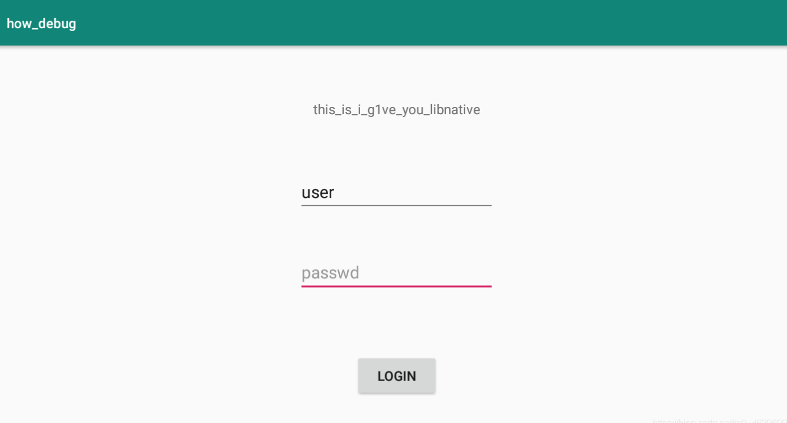
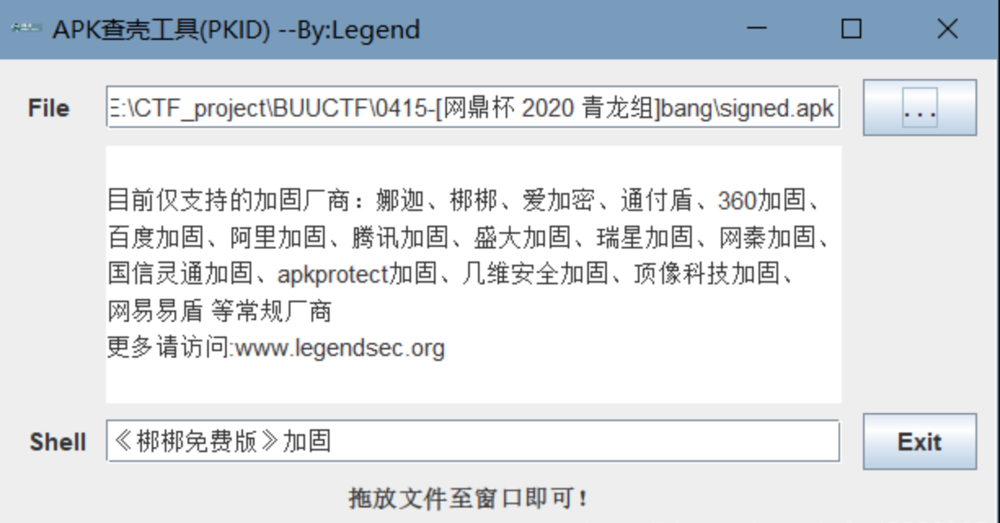
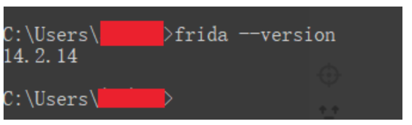
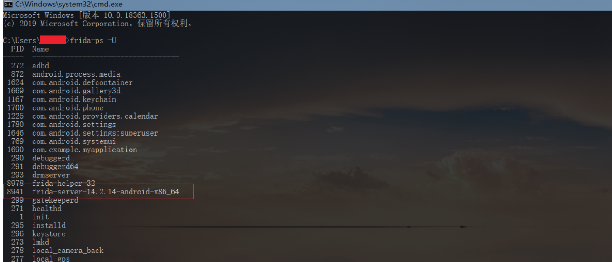
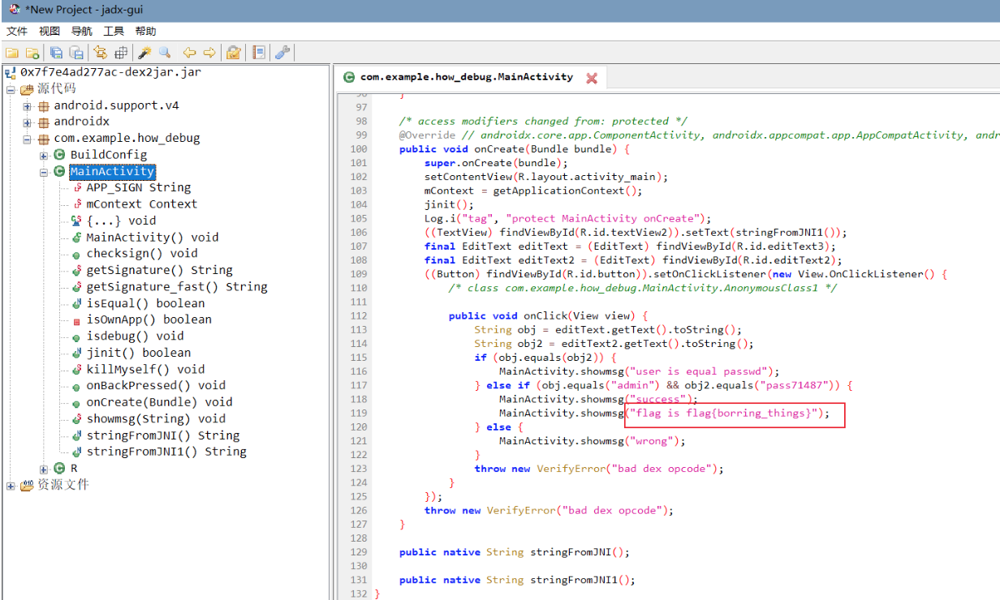

(202005)网鼎杯青龙组 Reverse-bang

[附件下载:Reverse-bang.zip](安卓去壳逆向/Reverse-bang.zip)

用到的软件:

1.Frida

2.MuMu模拟器

3.frida-tools

4.frida-sever

5.ApkScan-PKID查壳工具

6.jadx-gui逆向工具

拿到手是一个APK文件，模拟器里打开看一下：



接下来是查壳，apk查壳我们用PKID,本机路径(/逆向/apk逆向soft/ApkScan-PKID查壳工具.jar)



显示是梆梆加壳，接下来我们用[frida脚本](https://github.com/hluwa/FRIDA-DEXDump)脱壳，使用该脚本前需要配置frida环境

* Frida是一款轻量级HOOK框架，适用于多平台上，例如android、windows、ios等。
* frida的服务端运行在目标机上，通过注入进程的方式来实现劫持应用函数，另一部分运行在系统机器上。

第一步，我们先pip安装frida模块。cmd输入

```
pip install frida
```

第二步，安装frida-tools模块，命令同上，

```
pip install frida-tools 或者 python -m pip install frida-tools。
```

**第三步** ，下载运行在目标机上的frida-sever端（ =一定要对应你的frida版本和目标机架构= ），[官方下载地址](https://github.com/frida/frida/releases)，下载时要选择对应的版本下载，先cmd输入“frida --version”看自己安装的frida版本



再使自己的物理机连接上目标虚拟机，以我自己的（MuMu模拟器）为例：


MAC版MuMu模拟器如何连接adb

adb kill-server && adb server && adb shell

再分别输入“adb shell”和“cat /proc/cpuinfo”即可查看自己的目标机架构版本，但有些可能不能显示出目标机架构版本，所以我直接到客户端看了一下版本，可以看出我的是X64模拟器。

 结合我们的frida版本和目标机版本我们可以就选择下载frida-sever了，我这里下载的是frida-server-14.2.14-android-x86_64（因为我的frida版本是14.2.14，目标机是X64架构）

 **第四步** ，将之前下载好的文件解压，然后通过命令

```
adb push 你的电脑的存放位置 /data/local/tmp 

```

将文件传输到手机中

然后通过输入

```
adb shell
su
cd /data/local/tmp
```

进入目标机的/data/local/tmp目录下，输入

```
 chmod 777 frida-server-14.2.14-android-x86_64

```

给文件赋权777，
再输入

```
 ./frida-server-14.2.14-android-x86_64

```

启动。


第五步，新开一个命令行输入命令

```
frida-ps -U
```

查看手机进程，如果出现以下结果，则frida安装成功。



执行:

```
frida-dexdump -FU -d  com.example.how_debug
```

之后我们发现frida_dexdump新建了子文件夹com.example.how_debug，里面存放脱壳后的dex文件。

再用dex2jar工具反编译成.jar文件之后用[jadx-gui](https://github.com/skylot/jadx/releases/tag/v1.2.0)分析，在com.example.how_debug.MainActivity类中我们可以找到flag




参考文章:

https://blog.csdn.net/m0_46296905/article/details/115727899

https://blog.csdn.net/m0_46296905/article/details/115723160
